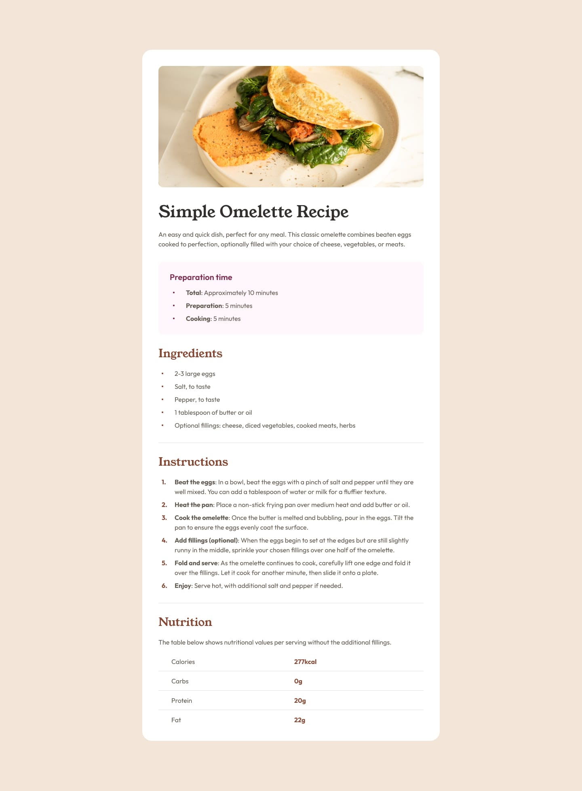
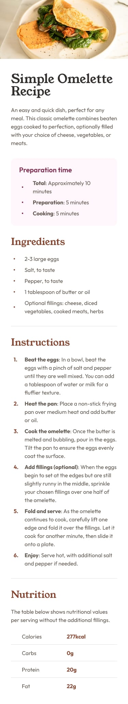

# Frontend Mentor - Recipe page

Frontend Mentor - [Recipe page](https://www.frontendmentor.io/challenges/recipe-page-KiTsR8QQKm)

## Table of contents

- [Overview](#overview)
  - [Screenshot](#screenshot)
  - [Links](#links)
- [My process](#my-process)
  - [Built with](#built-with)
  - [What I learned](#what-i-learned)
  - [Continued development](#continued-development)
- [Author](#author)

## Overview

### Screenshot

|  |  |
|:--:|:--:|
| Desktop | Mobile |

### Links

- Solution URL: [Frontend Mentor](https://www.frontendmentor.io/solutions/recipe-page-YjoUiuN0m5)
- Live Site URL: [Github Pages](https://rahulpaul127.github.io/fm-recipe-page-main/)

## My Process

### Built with
- Semantic HTML5 markup
- CSS custom properties
- Flexbox
- @font-face rule for custom local fonts
- Table

## What I learned

learned about table and much more overall understanding.

## Continued development

excited to learn more.

## Author

- Frontend Mentor - [@rahulpaul127](https://www.frontendmentor.io/profile/rahulpaul127)
- Twitter - [@rahulpaul127](https://x.com/rahulpaul127)
